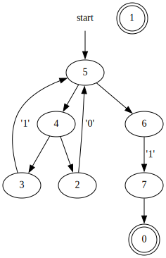

# automata_rust

Implementations and visualizations of some finite-state machines.

Currently, the library supports building nondeterministic finite automatons (NFAs) from regular expressions.
The generated NFAs can then be used to match patterns or perform lexical tokenization on strings.

## Usage

Generate a graph for the automaton that matches binary numbers ending with 1.

```sh
automata_rust svg --nfa "(0|1)*1$"
```

The above command generates the image below.
The unused node is a result of using separate states for 'end of input' and the actual accept state.



## Lexer

The lexer works by combining several NFAs.
A match group is inserted before the state machine enters the inner NFA.
This makes it possible to detect many matches with a single test.

See the example for more information: [expression_lexer](/examples/expression_lexer/README.md).

## TODO

- [x] NFA.
- [x] NFA Set.
- [x] Lexer.
- [x] Visualization
  - [x] Table
  - [x] SVG
- [ ] Complete DFA implementation.
- [ ] Add match groups to the regex parser.
- [ ] Add more commands to the binary.
